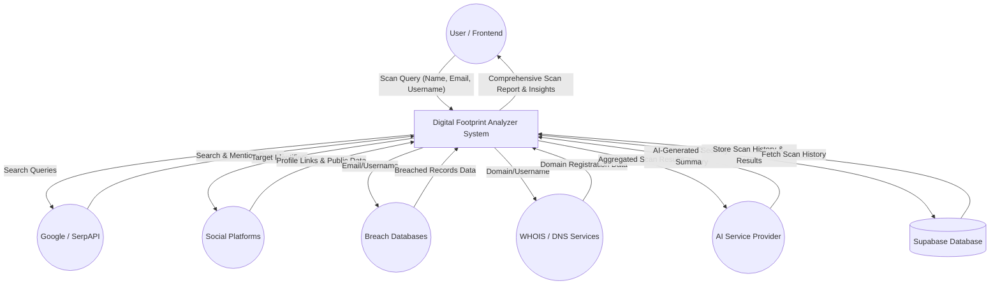
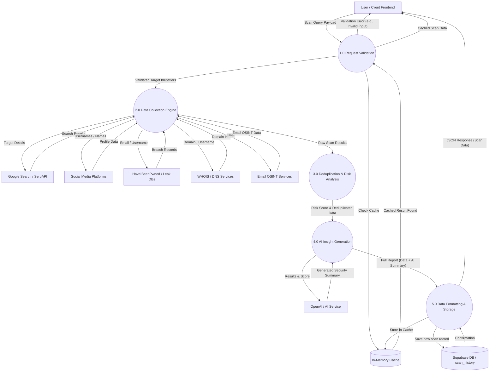

# Digital Footprint Analyzer - Data Flow Diagram

The following diagrams illustrate how data flows through the Digital Footprint Analyzer system, from the user's initial request to the final generated report. 

## Level 0: Context Diagram
This diagram shows the system as a single process interacting with external entities.

---

## Level 1: System Processes Diagram
This diagram breaks down the main system into its core sub-processes, showing how data is validated, collected, analyzed, and stored.

## Description of Processes (Level 1)
1. **1.0 Request Validation**: The system receives the scan query from the frontend dashboard. It validates the inputs (name, email, username), normalizes them, and checks the in-memory cache to see if this query was recently performed to avoid redundant external API calls.
2. **2.0 Data Collection Engine**: If the cache misses, the system executes multiple parallel scanners (`socialScanner`, `googleScanner`, `breachService`, etc.). It sends the respective identifiers to external APIs and retrieves raw data.
3. **3.0 Deduplication & Risk Analysis**: The raw results are aggregated. Social profiles are deduplicated based on source confidence priorities. A cumulative risk/privacy score is calculated based on the severity of the findings (e.g., breaches, exposed profiles).
4. **4.0 AI Insight Generation**: The processed results and risk score are passed to the AI Service (via `aiService.js`) to generate a human-readable security summary.
5. **5.0 Data Formatting & Storage**: The final comprehensive report is structured. It is stored persistently in the Supabase database (`scan_history` table), saved to the temporary in-memory cache, and finally returned as a JSON response to the user's dashboard.
