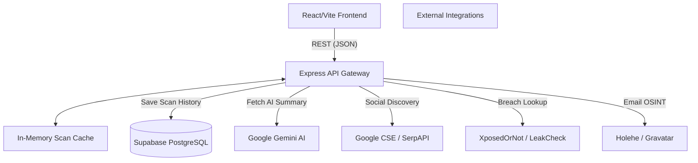
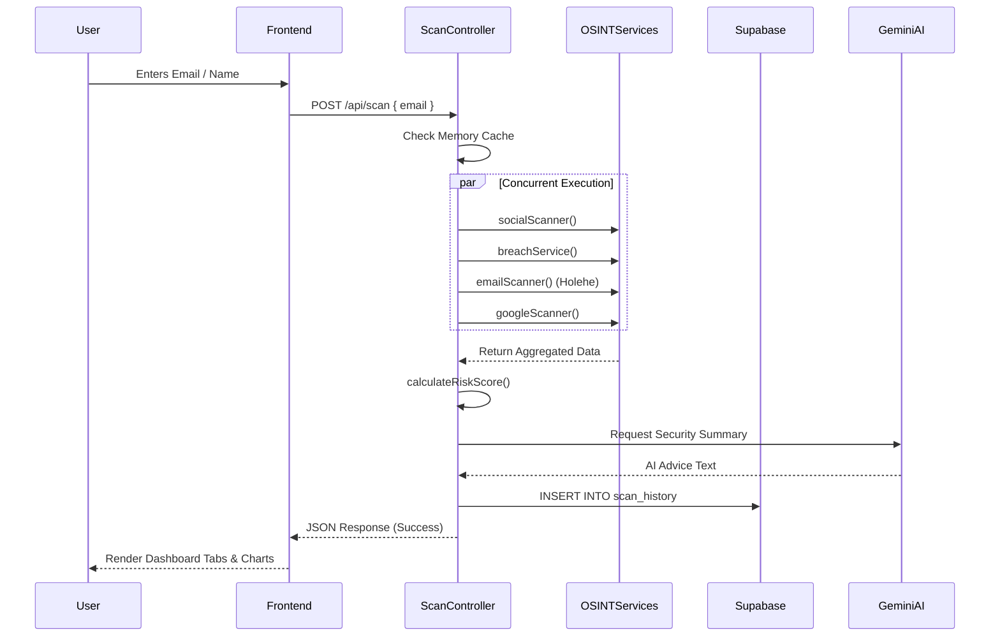

# Digital Footprint Analyzer
## Comprehensive Technical Project Report

**Date**: May 2026  
**Project**: Digital Footprint Analyzer (DFA)  
**Architecture**: Monolithic Monorepo (React/Vite Frontend + Node.js/Express Backend)  
**Database**: Supabase (PostgreSQL)  
**AI Integration**: Google Gemini AI (Pro & Flash Models)

---

## 1. Executive Summary

The Digital Footprint Analyzer is a highly advanced, zero-cost, privacy-centric application designed to comprehensively map an individual's digital presence. Unlike traditional OSINT (Open-Source Intelligence) tools that rely heavily on paid APIs, DFA utilizes an intelligent orchestration of web scraping, free API endpoints, search engine indexing (Google CSE/SerpAPI), and internal heuristic algorithms to locate profiles, detect data breaches, and monitor public mentions across the internet. 

The system leverages a beautiful, premium "Glassmorphism" UI built on React and Vite, paired with a robust backend powered by Node.js. It features integrated AI security analysis using Google's Gemini models to provide actionable, tailored advice based on the user's specific threat landscape.

---

## 2. System Architecture

The application follows a decoupled client-server model wrapped in a single monorepo, communicating via RESTful API endpoints. 

### Key Architectural Decisions
- **Concurrent Scanning**: The backend uses `Promise.allSettled()` to fire all OSINT scans simultaneously, dramatically reducing total scan time to ~3-8 seconds.
- **In-Memory Caching**: A 15-minute TTL cache (`scanCache`) prevents redundant external API calls, avoiding rate limits and saving bandwidth.
- **Deduplication Engine**: Built-in algorithms prevent duplicate social profiles or breaches from appearing, cross-referencing results from Google CSE and direct HTML checks.

---

## 3. Frontend Architecture

Built with **React 18**, **Vite**, **Tailwind CSS v4**, and **shadcn/ui**. The frontend is heavily stylized with glassmorphism, dynamic animations (Framer Motion), and a cream/dark mode theme.

### 3.1 Core Technologies
- **Routing**: `react-router-dom`
- **State Management**: React Context (`AuthContext`) and local state.
- **Animations**: `motion/react` for layout transitions and micro-interactions.
- **Charting**: `recharts` for visual data representation.
- **Icons**: `lucide-react`

### 3.2 Page Structure
| Page Component | Path | Purpose |
|----------------|------|---------|
| `Dashboard.tsx`| `/` | The core scanning interface. Houses the search bar, metric cards, and dynamically renders the report tabs upon scan completion. |
| `History.tsx` | `/history` | Displays a forensic timeline of all past scans retrieved from Supabase. Includes advanced filtering and the ability to view historical snapshots via a modal. |
| `Monitor.tsx` | `/monitor` | A dedicated page for setting up breach watchlists and background monitoring. |
| `Login.tsx` | `/login` | Supabase OAuth integration (Google & Email/Password). |

### 3.3 Notable UI Components
- `<ExposureMap />`: Uses `recharts` to render a beautiful globe/map visualization showing where a user's data is most exposed.
- `<EmailIntelligence />`: Displays deliverability, Gravatar integration, and Holehe registration metrics in a sleek grid.
- `<SecurityChecklist />`: A highly actionable, dynamic checklist that adapts based on the user's specific breach/social data.
- `<PrivacyScore />`: A circular progress ring calculating a risk score (0-100) based on exposure volume.

---

## 4. Backend Services & Logic

The backend is a monolithic Node.js/Express server containing highly specialized OSINT micro-services.

### 4.1 Orchestrator: `scanController.js`
The heart of the application. It receives a query (`name`, `email`, or `username`), normalizes the data, creates variants (e.g., converting "John Doe" to "johndoe", "john.doe"), and fires all scanners concurrently. It handles failure gracefully—if one scanner fails due to rate limits, the rest of the report still generates. 

### 4.2 `socialScanner.js` (The Discovery Engine)
- **Strategy Pattern**: Implements unique detection strategies per platform (e.g., `instagram-api`, `facebook-redirect`, `direct`).
- **Heuristics**: Checks HTTP 3xx redirects (e.g., login walls) to confirm if an account exists when public scraping is blocked.
- **Search Fallback**: If direct HTML checks fail, it falls back to Google Custom Search Engine (CSE) using precise `site:` queries to find profiles in the Google index.

### 4.3 `breachService.js` (Dark Web / Breach Search)
- **Multi-Source**: Queries both **XposedOrNot** (100% free) and **LeakCheck**.
- **Data Normalization**: Translates raw breach data into human-readable formats (e.g., "dates of birth" -> "Date of Birth").
- **Severity Scoring**: Analyzes the *types* of data exposed (passwords, SSN = High; names, dates = Medium) to assign a severity risk per breach.

### 4.4 `emailScanner.js` (Email OSINT)
- **Holehe Wrapper**: Spawns a Python child process to run `holehe`, which checks if an email is registered on 120+ websites using forgot-password endpoints (without alerting the user).
- **DNS/MX Checks**: Validates if the email domain can physically receive emails and identifies the provider (Google, Microsoft, Proton).
- **Gravatar Integration**: Hashes the email via MD5 and queries Gravatar for linked avatars, names, and bio data.

### 4.5 `aiService.js` (Security AI)
- Uses `@google/generative-ai`.
- **Model Waterfall**: Tries `gemini-2.0-flash`, falls back to `gemini-1.5-pro`, etc.
- **Anti-Hallucination Prompting**: Strictly instructed to *only* analyze the JSON payload provided and never invent breaches or advice not rooted in the scan data.

### 4.6 `nameSearchService.js` & `googleScanner.js`
- Uses SerpAPI and Google CSE to find "Public Mentions" (news articles, forums, PDFs) associated with the target's name.

---

## 5. Database Schema (Supabase)

The application utilizes Supabase (PostgreSQL) for authentication and data persistence.

### Table: `scan_history`
Stores point-in-time snapshots of forensic scans.

| Column | Type | Description |
|--------|------|-------------|
| `id` | UUID (PK) | Unique identifier for the scan. |
| `user_id` | UUID (FK) | Links to Supabase Auth user. |
| `query` | Text | The input used for the scan. |
| `social_results` | JSONB | Array of discovered social profiles. |
| `breach_results` | JSONB | Array of discovered data breaches. |
| `google_results` | JSONB | Array of public mentions. |
| `email_results` | JSONB | Output from Holehe and Gravatar. |
| `whois_results` | JSONB | Domain registry data (if applicable). |
| `risk_score` | Integer | The calculated threat score (0-100). |
| `ai_summary` | Text | The generated Gemini AI security advice. |
| `created_at` | Timestamp | Time of the scan. |

---

## 6. Flowchart: The Scanning Process

---

## 7. Performance & Optimization

1. **Vite PWA**: The application is configured as a Progressive Web App via `vite-plugin-pwa`, allowing desktop and mobile installation with offline caching for static assets.
2. **Component Lazy Loading**: Uses Radix UI primitives (`@radix-ui/*`) which are highly modular and accessible, keeping the DOM lightweight.
3. **API Rate Limiting**: The backend uses `express-rate-limit` to prevent abuse.
4. **Resiliency**: The backend uses `Promise.allSettled()` instead of `Promise.all()`. If an external API (like Google Search) throws a 429 Rate Limit error, the application does not crash. It catches the rejection, logs a warning, and returns the rest of the available OSINT data perfectly intact to the user.

---

## End of Report
*Generated autonomously by Antigravity AI.*
